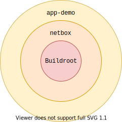

WeOS Application Demos
======================

This repository is intended as a starting point for application
developers looking to deploy their applications as containers running
on top of Westermo's [WeOS](https://www.westermo.com/solutions/weos)
operating system.

At its core, [Buildroot](https://buildroot.org) is employed to provide
a solid build system, providing recipes for building thousands of open
source packages, handling all the intricacies of dependency
management, cross-compilation etc.

In order for developers to easily access the Westermo specific
custimizations made to Linux, it is recommended that your application,
just like app-demo, is built on top of
[netbox](https://github.com/westermo/netbox), which is where all such
modifications are published.

Using the [External
Tree](https://buildroot.org/downloads/manual/manual.html#outside-br-custom)
facility in Buildroot, app-demo is layered on top of netbox, which in
turn is layered on top of Buildroot itself using the same mechanism.

Building a Demo
---------------

The [Buildroot
Manual](https://buildroot.org/downloads/manual/manual.html) is very
comprehensive and a great resource for learning about the build
system. In addition, running `make help` in the app-demo root
directory will show a summary of the most commonly used commands.

In order to build a container image, the repository must first be
configured. To list the available configuration targets, run `make
list-defconfigs`.

To select, for example, the `backbone` demo, run `make
demo_backbone_defconfig`. A curses based configuration interface can
be summoned with `make menuconfig` to select any additional packages
to build.

Finally we can build the image using `make`. Expect an initial build
to take around 15 minutes on a reasonably modern machine; subsequent
incremental builds are much faster.

Once the build is done, your app image is available in
`output/images/rootfs.squashfs`.

Available Demos
---------------

[Backbone](src/backbone/README.md)

Repository Layout
-----------------

app-demo follows the [Example
layout](https://buildroot.org/downloads/manual/manual.html#_example_layout)
proposed in the Buildroot manual.

- `board/demo/${TARGET}`: Customizations for each target.
- `configs/`: Default configurations.
- `netbox/`: Git submodule pointing to the netbox repo which in turn
  contains a submodule reference to Buildroot.
- `output/`: All generated artifacts are stored in this here.
- `package/`: Recipes for building some piece of software, either by
  downloading a tarball or by referencing a directory in `src/`.
- `src/`: Source code for the sample applications developed by
  Westermo.

This is an _example_ of how an external Buildroot tree can be
structured, most of it can be changed to better suit the needs of the
developer if required. In fact, WeOS makes no assumptions on the
application container even using Buildroot at all; you are free to use
any build system as long as the result is a SquashFS image containing
an executable `/sbin/init` which is compatible with the target
architecture.
